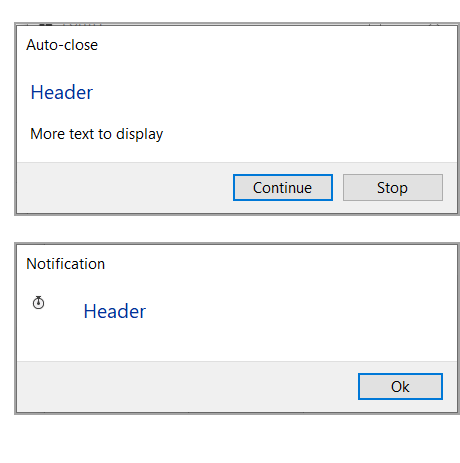

# Auto-close dialog

Example for an auto-close dialog.

- [More examples](https://github.com/karenpayneoregon/task-dialog-csharp)
- [Library](https://github.com/karenpayneoregon/task-dialog-library)

