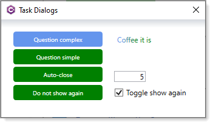
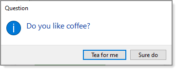
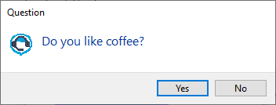
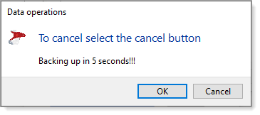

# About

This project shows how to use TaskDialog in a WPF Core application where the main difference between this project and the Windows Form project is that for Windows Forms TaskDialog accepts a control or form while for WPF we need to pass in a IntPtr.

There are less examples here than in the Windows form code sample but easy enough to add them here, in this project.

### Question 1

### Question 2

### Information

### Auto close

Has a parameter for second to wait.

