# .NET Core TaskDialog

When an application requires a message to be display or to ask a user questions the common method is to use a [MessageBox](https://docs.microsoft.com/en-us/dotnet/api/system.windows.forms.messagebox?view=windowsdesktop-6.0).

:heavy_check_mark: See [article](https://dev.to/karenpayneoregon/net-core-taskdialog-2o4l)


> **Note**
> With .NET Core 5 and higher there is TaskDialog. All code provided started out as .NET Core 5 and has been updated to use .NET Core 7. 

A standard `message box` with its many `overloads` for `Show` method is fine for simply displaying and asking for input (without a input/textbox) while the TaskDialog provides more flexibilities. With these flexibilities comes more code which can be placed into a separate class in a project or better, place code into a separate class project. To use the class project, add a reference to a project or create a NuGet local package and install the package in any project.

Below find common examples for using a TaskDialog in a Windows Form and WPF projects. And note that there are many more methods to explore in the class project WindowsFormsLibrary.


</br>

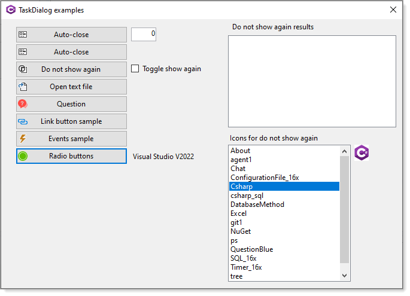

</br>

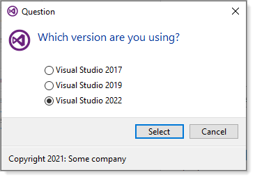

:bulb: There are 25 plus examples to learn `TaskDialog` from, take time to traverse the code rather than simply running the code samples to get a grasp of what is possible.

## Front end projects

There are two frontend projects, one Windows Forms and one WPF. The Windows Forms project has more code samples but the WPF project is capable of the same code as found in the Windows Forms project. Why? Generally speaking there are more developers using Windows Forms than WPF.

A third project, AutoCloseNotTaskDialog is a clean way to have a auto closing MessageBox prior to .NET Core 5. This project has not been updated to .NET Core 7.

## How to use

Best way to use the code is to take the class project WindowsFormsLibrary, place it in a Visual Studio solution then build the solution.

For ease of use, redirect the build output to a library folder e.g. C:\DotNet\Libraries then when needed in a frontend project, add a reference to the dll. Alternate is to create a local NuGet package, add the local NuGet folder to NuGet package manager under Visual Studio and when needed install the package to a project.

Here the author (Karen) uses C:\Dotnetland\NuGet for local packages

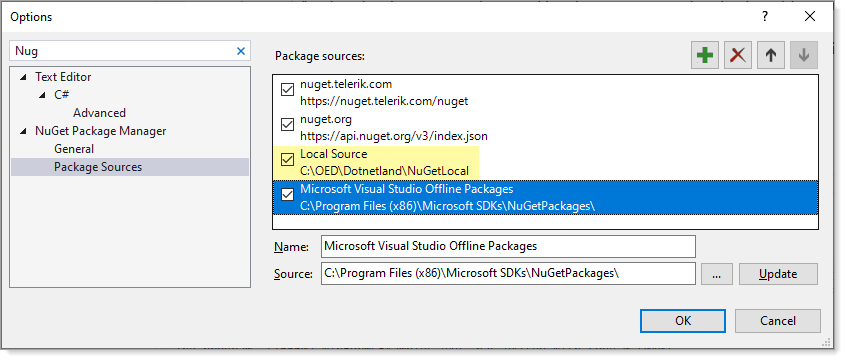


### Basic example to display a message

The following will display a message center screen.

```csharp
MessageBox.Show("Something went wrong!!!");
```

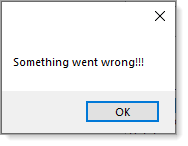

There is an overload to center a MessageBox on a form which looks simple

```csharp
Show(IWin32Window, String)
```

But try and implement it is not so easy, we need to create a method to transform a form handle using

```csharp
public class Win32Window : IWin32Window
{
    readonly IntPtr handle;
    public Win32Window(IWin32Window window)
    {
        handle = window.Handle;
    }
    IntPtr IWin32Window.Handle => handle;
}
```

Which is passed as the first parameter to the Show method.

Using `TaskDialog` use the following code.

```csharp
/// <summary>
/// displays a message with option to assign button text
/// </summary>
/// <param name="owner">control or form</param>
/// <param name="heading"></param>
/// <param name="buttonText"></param>
public static void Information(Control owner, string heading, string buttonText = "Ok")
{

    TaskDialogButton okayButton = new (buttonText);

    TaskDialogPage page = new ()
    {
        Caption = "Information",
        SizeToContent = true,
        Heading = heading,
        Icon = TaskDialogIcon.Warning,
        Buttons = new TaskDialogButtonCollection() { okayButton }
    };
    
    TaskDialog.ShowDialog(owner, page);

}
```

**Usage**

```csharp
Dialogs.Information(this,"Something went wrong");
```

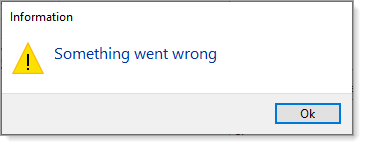

Let's use our own Icon from project resources (available in code)

```csharp
/// <summary>
/// displays a message with option to assign button text
/// </summary>
/// <param name="owner">control or form</param>
/// <param name="heading"></param>
/// <param name="buttonText"></param>
public static void Information(Control owner, string heading, string buttonText = "Ok")
{
    TaskDialogButton okayButton = new (buttonText);

    TaskDialogPage page = new ()
    {
        Caption = "Information",
        SizeToContent = true,
        Heading = heading,
        Icon = new TaskDialogIcon(Properties.Resources.Explaination),
        Buttons = new TaskDialogButtonCollection() { okayButton }
    };
    
    TaskDialog.ShowDialog(owner, page);

}
```

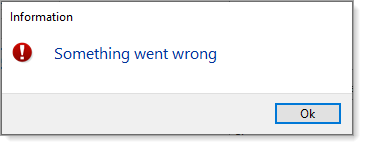

Using the buttonText to override the default text of OK.

```csharp
Dialogs.Information(this,"Something went wrong", "Oooops");
```


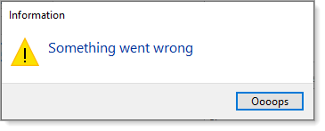

:bulb: Dialogs can be removed by using a static import using statement

```csharp
using static WindowsFormsLibrary.Classes.Dialogs;
```

### Basic example to ask a question

With MessageBox, a question is done as shown below

```csharp
if (MessageBox.Show("Would you like a cup of Coffee?", "Question", MessageBoxButtons.YesNo, MessageBoxIcon.Question) == DialogResult.Yes)
{
    ...
}
else
{
    ...
}
```

Like in the first example to show a message, the handle may be passed to center the dialog on the form.

A cleaner method is to place the following code in a class

```csharp
        public static bool Question(string text) =>
            (MessageBox.Show(text, "Question", 
                MessageBoxButtons.YesNo, MessageBoxIcon.Question, MessageBoxDefaultButton.Button2) == DialogResult.Yes);
```

Usage

```csharp
if (Dialogs.Question("Would you like a cup of Coffee?"))
{
    ...
}
else
{
    ...
}
```

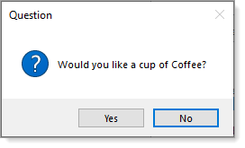

With TaskDialog we can have several overloads

Let's show an example using WPF

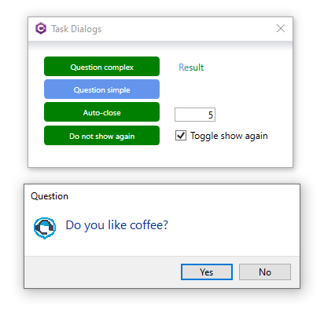


```csharp
/// <summary>
/// Dialog to ask a question
/// </summary>
/// <param name="caption">text for dialog caption</param>
/// <param name="heading">text for dialog heading</param>
/// <param name="yesText">text for yes button</param>
/// <param name="noText">text for no button</param>
/// <param name="defaultButton">specifies the default button for this dialog</param>
/// <returns>true for yes button, false for no button</returns>
public static bool Question(string caption, string heading, string yesText, string noText, DialogResult defaultButton)
{

TaskDialogButton yesButton = new (yesText) { Tag = DialogResult.Yes };
TaskDialogButton noButton = new (noText) { Tag = DialogResult.No };

TaskDialogButtonCollection buttons = new ();

if (defaultButton == DialogResult.Yes)
{
    buttons.Add(yesButton);
    buttons.Add(noButton);
}
else
{
    buttons.Add(noButton);
    buttons.Add(yesButton);
}

TaskDialogPage page = new ()
{
    Caption = caption,
    SizeToContent = true,
    Heading = heading,
    Icon = TaskDialogIcon.Information,
    Buttons = buttons
};


TaskDialogButton result = TaskDialog.ShowDialog(page);

return (DialogResult)result.Tag == DialogResult.Yes;

}

/// <summary>
/// Dialog to ask a question
/// </summary>
/// <param name="owner">control or form</param>
/// <param name="caption">text for dialog caption</param>
/// <param name="heading">text for dialog heading</param>
/// <param name="yesText">text for yes button</param>
/// <param name="noText">text for no button</param>
/// <param name="defaultButton">specifies the default button for this dialog</param>
/// <returns>true for yes button, false for no button</returns>
public static bool Question(Form owner, string caption, string heading, string yesText, string noText, DialogResult defaultButton)
{

TaskDialogButton yesButton = new (yesText) { Tag = DialogResult.Yes };
TaskDialogButton noButton = new (noText) { Tag = DialogResult.No };

var buttons = new TaskDialogButtonCollection();

if (defaultButton == DialogResult.Yes)
{
    buttons.Add(yesButton);
    buttons.Add(noButton);
}
else
{
    buttons.Add(noButton);
    buttons.Add(yesButton);
}


TaskDialogPage page = new ()
{
    Caption = caption,
    SizeToContent = true,
    Heading = heading,
    Icon = TaskDialogIcon.Information,
    Buttons = buttons
};

var result = TaskDialog.ShowDialog(owner, page);

return (DialogResult)result.Tag == DialogResult.Yes;

}
/// <summary>
/// WPF Dialog to ask a question
/// </summary>
/// <param name="owner">window</param>
/// <param name="caption">text for dialog caption</param>
/// <param name="heading">text for dialog heading</param>
/// <param name="yesText">text for yes button</param>
/// <param name="noText">text for no button</param>
/// <param name="defaultButton">specifies the default button for this dialog</param>
/// <returns>true for yes button, false for no button</returns>
public static bool Question(IntPtr owner, string caption, string heading, string yesText, string noText, DialogResult defaultButton = DialogResult.No)
{

TaskDialogButton yesButton = new(yesText) { Tag = DialogResult.Yes };
TaskDialogButton noButton = new(noText) { Tag = DialogResult.No };

var buttons = new TaskDialogButtonCollection();

if (defaultButton == DialogResult.Yes)
{
    buttons.Add("yesButton");
    buttons.Add("noButton");
}
else
{
    buttons.Add(noButton);
    buttons.Add(yesButton);
}

TaskDialogPage page = new()
{
    Caption = caption,
    SizeToContent = true,
    Heading = heading,
    Icon = TaskDialogIcon.Information,
    Buttons = buttons
};

var result = TaskDialog.ShowDialog(owner, page, TaskDialogStartupLocation.CenterOwner);

return (DialogResult)result.Tag == DialogResult.Yes;

}

/// <summary>
/// Windows Forms dialog to ask a question
/// </summary>
/// <param name="owner"></param>
/// <param name="heading">text for dialog heading</param>
/// <param name="icon">Icon to display</param>
/// <param name="defaultButton">Button to focus</param>
/// <returns>true for yes button, false for no button</returns>
public static bool Question(Control owner, string heading, Icon icon, DialogResult defaultButton = DialogResult.Yes)
{

TaskDialogButton yesButton = new("Yes") { Tag = DialogResult.Yes };
TaskDialogButton noButton = new("No") { Tag = DialogResult.No };

var buttons = new TaskDialogButtonCollection();

if (defaultButton == DialogResult.Yes)
{
    buttons.Add(yesButton);
    buttons.Add(noButton);
}
else
{
    buttons.Add(noButton);
    buttons.Add(yesButton);
}

TaskDialogPage page = new()
{
    Caption = "Question",
    SizeToContent = true,
    Heading = heading,
    Icon = new TaskDialogIcon(icon),
    Buttons = buttons
};

var result = TaskDialog.ShowDialog(owner, page);

return (DialogResult)result.Tag == DialogResult.Yes;

}
/// <summary>
/// Windows Forms dialog to ask a question
/// </summary>
/// <param name="owner"></param>
/// <param name="heading">text for dialog heading</param>
/// <param name="defaultButton">Button to focus</param>
/// <returns>true for yes button, false for no button</returns>
public static bool Question(Control owner, string heading, DialogResult defaultButton = DialogResult.Yes)
{

TaskDialogButton yesButton = new("Yes") { Tag = DialogResult.Yes };
TaskDialogButton noButton = new("No") { Tag = DialogResult.No };

TaskDialogButtonCollection buttons = new TaskDialogButtonCollection();

if (defaultButton == DialogResult.Yes)
{
    buttons.Add(yesButton);
    buttons.Add(noButton);
}
else
{
    buttons.Add(noButton);
    buttons.Add(yesButton);
}

TaskDialogPage page = new()
{
    Caption = "Question",
    SizeToContent = true,
    Heading = heading,
    Icon = new TaskDialogIcon(Properties.Resources.QuestionBlue),
    Buttons = buttons, 
    AllowCancel = true
};

var result = TaskDialog.ShowDialog(owner, page);
return result.Tag is not null && (DialogResult)result.Tag == DialogResult.Yes;
}

/// <summary>
/// Windows Forms dialog to ask a question
/// </summary>
/// <param name="owner"></param>
/// <param name="heading">text for dialog heading</param>
/// <param name="yesAction"></param>
/// <returns>true for yes button, false for no button</returns>
public static void Question(Control owner, string heading, Action yesAction, Action noAction)
{

TaskDialogButton yesButton = new("Yes") { Tag = DialogResult.Yes };
TaskDialogButton noButton = new("No") { Tag = DialogResult.No };

var buttons = new TaskDialogButtonCollection
{
    yesButton,
    noButton
};


TaskDialogPage page = new()
{
    Caption = "Question",
    SizeToContent = true,
    Heading = heading,
    Icon = new TaskDialogIcon(Properties.Resources.QuestionBlue),
    Buttons = buttons
};

var result = TaskDialog.ShowDialog(owner, page);

if ((DialogResult)result.Tag == DialogResult.Yes)
{
    yesAction?.Invoke();
}
else
{
    noAction?.Invoke();
}

}
/// <summary>
/// Windows Forms dialog to ask a question
/// </summary>
/// <param name="heading">text for dialog heading</param>
/// <param name="icon">Icon to display</param>
/// <param name="defaultButton">Button to focus</param>
/// <returns>true for yes button, false for no button</returns>
public static bool Question(string heading, Icon icon, DialogResult defaultButton = DialogResult.Yes)
{

TaskDialogButton yesButton = new("Yes") { Tag = DialogResult.Yes };
TaskDialogButton noButton = new("No") { Tag = DialogResult.No };

var buttons = new TaskDialogButtonCollection();

if (defaultButton == DialogResult.Yes)
{
    buttons.Add(yesButton);
    buttons.Add(noButton);
}
else
{
    buttons.Add(noButton);
    buttons.Add(yesButton);
}

TaskDialogPage page = new()
{
    Caption = "Question",
    SizeToContent = true,
    Heading = heading,
    Icon = new TaskDialogIcon(icon),
    Buttons = buttons
};

var result = TaskDialog.ShowDialog(page);

return (DialogResult)result.Tag == DialogResult.Yes;

}
/// <summary>
/// WPF dialog to ask a question
/// </summary>
/// <param name="owner"></param>
/// <param name="heading">text for dialog heading</param>
/// <param name="icon">Icon to display</param>
/// <param name="defaultButton">Button to focus</param>
/// <returns>true for yes button, false for no button</returns>
public static bool Question(IntPtr owner, string heading, Icon icon, DialogResult defaultButton = DialogResult.Yes)
{

TaskDialogButton yesButton = new("Yes") { Tag = DialogResult.Yes };
TaskDialogButton noButton = new("No") { Tag = DialogResult.No };

var buttons = new TaskDialogButtonCollection();

if (defaultButton == DialogResult.Yes)
{
    buttons.Add(yesButton);
    buttons.Add(noButton);
}
else
{
    buttons.Add(noButton);
    buttons.Add(yesButton);
}

TaskDialogPage page = new()
{
    Caption = "Question",
    SizeToContent = true,
    Heading = heading,
    Icon = new TaskDialogIcon(icon),
    Buttons = buttons
};


var result = TaskDialog.ShowDialog(owner, page, TaskDialogStartupLocation.CenterOwner);

return (DialogResult)result.Tag == DialogResult.Yes;

}
```

**Note** we can also use `Actions` passed to a Question.

```csharp
Dialogs.Question(this, "Ask something", YesMethod, NoMethod);
```

Setup events for the above that are in scope to the method used above.

```csharp
public void YesMethod()
{
    Debug.WriteLine(nameof(YesMethod));
}
public void NoMethod()
{
    Debug.WriteLine(nameof(NoMethod));
}
```


### Basic example auto-close dialog

With TaskDialog we can create a method to auto-close as shown below where the last parameter is how many seconds to wait before closing using a customer NumericUpDown control.

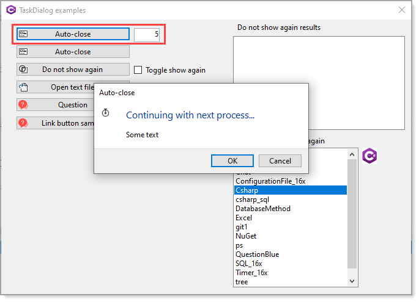

```csharp
Dialogs.AutoCloseDialog(this,Properties.Resources.Timer_16x,SecondsUpDown.AsInteger);
```

Method for above

```csharp
/// <summary>
/// Auto close dialog by specified seconds, if timed out
/// invoke continue button.
/// </summary>
/// <param name="owner">control or form</param>
/// <param name="Icon">icon to present</param>
/// <param name="seconds">seconds to timeout</param>
/// <param name="okText">text for continue button</param>
/// <param name="cancelText">text for cancel button</param>
public static void AutoCloseDialog(Control owner, Icon Icon, int seconds, string okText = "OK", string cancelText = "Cancel")
{

    var remaining = seconds * 10;

    TaskDialogButton continueButton = new(okText);
    TaskDialogButton cancelButton = new(cancelText);

    TaskDialogPage page = new()
    {
        Heading = "Continuing with next process...",
        Text = "Some text",
        Icon = new TaskDialogIcon(Icon),
        Buttons = new TaskDialogButtonCollection() { continueButton, cancelButton },
        Caption = "Auto-close"
    };

    using Timer timer = new()
    {
        Enabled = true,
        Interval = 100
    };

    timer.Tick += (_, _) =>
    {
        remaining -= 1;

        if (remaining != 0) return;
        timer.Enabled = false;
        if (continueButton.BoundPage is not null)
        {
            continueButton.PerformClick();
        }
    };

    TaskDialogButton result = TaskDialog.ShowDialog(owner, page);

    ContinueOperation?.Invoke(result == continueButton);

}
```

### Do not show again example

Displaying a message box with an option to now show again as shown below is not possible with a MessageBox.


Firs thing which is needed is a place to remember do not show again settings. Here a json file is used.

```json
{
  "ShowAgain": true,
  "Heading": "Are you sure you want to stop?",
  "Text": "Stopping the operation might leave your database in a corrupted state.",
  "Caption": "Confirmation",
  "VerificationText": "Do not show again"
}
```

Using the following class to provide dialog settings where `ShowAgain` is set from the result of the following method.

```csharp
/// <summary>
/// Display a dialog with option to not display again where thier choice
/// is stored in appsettings.json
/// </summary>
/// <param name="sender"></param>
/// <param name="e"></param>
private void DoNotShowAgainButton_Click(object sender, RoutedEventArgs e)
{
    var settings = SettingOperations.GetSetting;

    if (!settings.ShowAgain) return;
    ShowAgainOptions options = new ShowAgainOptions
    {
        Heading = settings.Heading,
        Text = settings.Text,
        Caption = settings.Caption,
        Icon = _DatabaseIcon,
        VerificationText = settings.VerificationText,
        IntPtr = _intPtr
    };

    (NoShowResult DialogResult, bool ShowAgain) result = Dialogs.DoNotShowAgain(options);
    ShowAgainCheckBox.IsChecked = result.ShowAgain;

}
```

Usage shown for WPF (a Windows Form version is also available)

```csharp
private void DoNotShowAgainButton_Click(object sender, RoutedEventArgs e)
{
    var settings = SettingOperations.GetSetting;

    if (!settings.ShowAgain) return;
    ShowAgainOptions options = new ShowAgainOptions
    {
        Heading = settings.Heading,
        Text = settings.Text,
        Caption = settings.Caption,
        Icon = _DatabaseIcon,
        VerificationText = settings.VerificationText,
        IntPtr = _intPtr
    };

    (NoShowResult DialogResult, bool ShowAgain) result = Dialogs.DoNotShowAgain(options);
    ShowAgainCheckBox.IsChecked = result.ShowAgain;

}
```

### Link buttons

These are really nice how we can setup buttons and in this case open a web page.

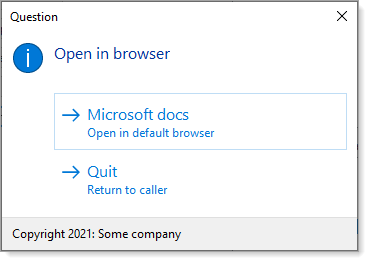

```csharp
/// <summary>
/// Example for opening a web page for windows forms
/// </summary>
/// <param name="owner">control or form</param>
public static void OpenLink(Control owner)
{
    TaskDialogCommandLinkButton continueButton = new("&Quit", "Return to caller");
    TaskDialogCommandLinkButton linkButton = new("&Microsoft docs", "Open in default browser");

    linkButton.SetAddress("https://docs.microsoft.com/en-us/documentation/");

    linkButton.Click += LinkButtonClick;

    TaskDialogPage page = new()
    {
        Caption = "Question",
        Heading = "Open in browser",
        AllowCancel = true,
        Footnote = new TaskDialogFootnote() { Text = $"Copyright {Now:yyyy}: Some company" },
        Buttons = { linkButton, continueButton }, 
        Icon = TaskDialogIcon.Information
    };

    TaskDialog.ShowDialog(owner,page);

}
```
### With a progress bar

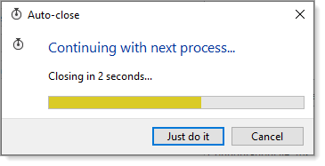

```csharp
public static void AutoClosingTaskDialog(Icon Icon)
{

    const string textFormat = "Closing in {0} seconds...";
    var remainingTenthSeconds = 30;

    TaskDialogButton continueButton = new ("Just do it");
    TaskDialogButton cancelButton = TaskDialogButton.Cancel;
    
    TaskDialogPage page = new ()
    {
        Heading = "Continuing with next process...",
        Text = string.Format(textFormat, (remainingTenthSeconds + 9) / 10),
        Icon = new TaskDialogIcon(Icon),
        ProgressBar = new TaskDialogProgressBar() { State = TaskDialogProgressBarState.Paused },
        Buttons = new TaskDialogButtonCollection() { continueButton, cancelButton }, 
        Caption = "Auto-close"
    };

    using Timer timer = new ()
    {
        Enabled = true,
        Interval = 100
    };

    timer.Tick += (_, _) =>
    {
        remainingTenthSeconds -= 1;

        if (remainingTenthSeconds > 0)
        {
            page.Text = string.Format(textFormat, (remainingTenthSeconds + 9) / 10);
            page.ProgressBar.Value = 100 - remainingTenthSeconds * 2;
        }
        else
        {
            timer.Enabled = false;

            if (continueButton.BoundPage is not null)
            {
                continueButton.PerformClick();
            }
            
        }
    };

    TaskDialogButton result = TaskDialog.ShowDialog(page);

    ContinueOperation?.Invoke(result == continueButton);

}
```

### Implement with Radio buttons

In the code sample Radio buttons are used along with showing how to handle radio button and link button events.

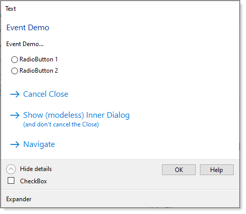


Example using events


First setup an event for allowing the caller to know the selection.

```csharp
public delegate void OnCheck(TaskDialogRadioButton radioButton);
public static event OnCheck VisualStudioChecked;
```

For the method to display a TaskDialog with, in this case three [TaskDialogRadioButton](https://docs.microsoft.com/en-us/dotnet/api/system.windows.forms.taskdialogradiobutton?view=windowsdesktop-6.0).

- Create selection buttons, one for okay and one for cancel
- Setup the TaskDialogPage with a Icon from project resources which will 
  - Not beep on Shown
  - Provides a distinct image to go along with the question
- Setup each radio button's tag with an enum, each for a different version of Visual Studio
- Subscribe to CheckedChanged for each TaskDialogRadioButton which the calling form listens
- Get the results to return in a named value tuple.

enum for bullet 3

```csharp
public enum VisualStudioVersion
{
    V2017,
    V2019,
    V2022,
    None
}
```

Extension method for obtaining the selected radio button

```csharp
public static VisualStudioVersion Version(this TaskDialogRadioButton sender) => 
   sender is null ? VisualStudioVersion.None : (VisualStudioVersion)sender.Tag;
```

---


**Microsoft docs** [TaskDialog](https://docs.microsoft.com/en-us/dotnet/api/system.windows.forms.taskdialog?view=windowsdesktop-6.0)

# WindowsFormsLibrary

This class project contains code samples ready to use for TaskDialogs for Windows Forms and WPF.

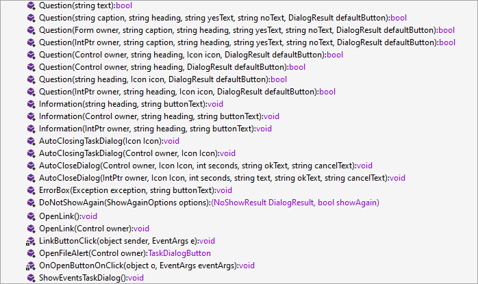


For pre .NET Core, [AutoClosingMessageBox](https://www.nuget.org/packages/AutoClosingMessageBox/) for auto-closing message boxes.


